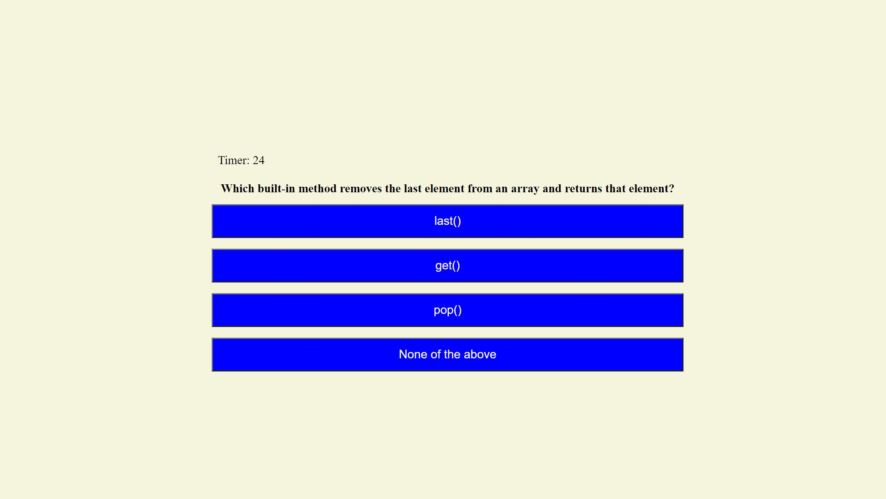
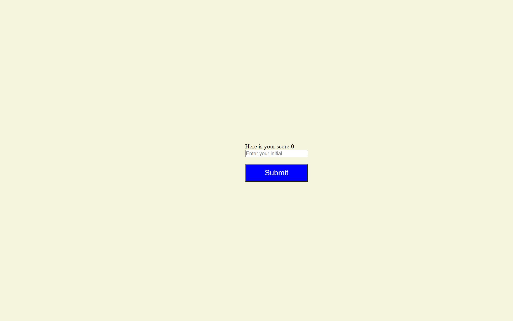
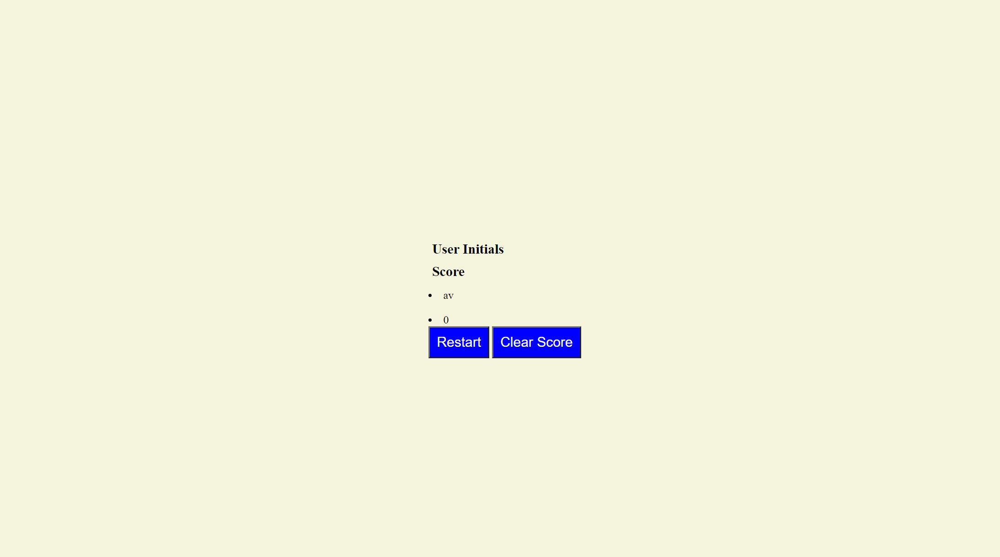

# Quiz-JavaScript-
## General Discription:
GIVEN I am taking a code quiz 
WHEN I click the start button 
THEN a timer starts and I am presented with a question 
WHEN I answer a question 
THEN I am presented with another question 
WHEN I answer a question incorrectly 
THEN time is subtracted from the clock 
WHEN all questions are answered or the timer reaches 0 
THEN the game is over 
WHEN the game is over 
THEN I can save my initials and score 
## Here is the link to my site:
https://avuong19.github.io/Quiz-JavaScript-/

## Here is how to play it 
### Get started page

### Here is the questions, you will have 30s to answer 5 question, if you get 1 wrong, you will lose 5s

### Here is the result page, you can put your initals in to save in scoreboard

### The score board will display high score, you will get to restart the game or clear the score board.

## GOOD LUCK!